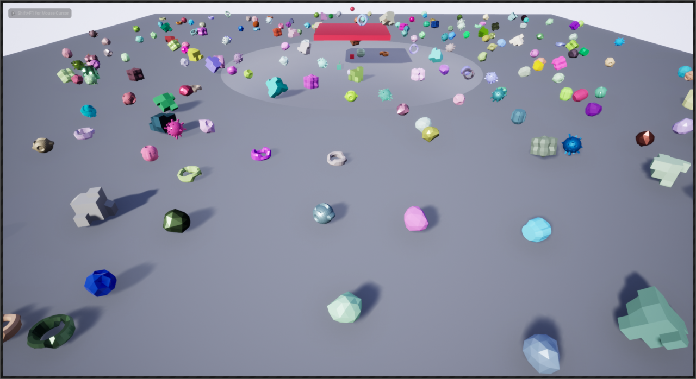
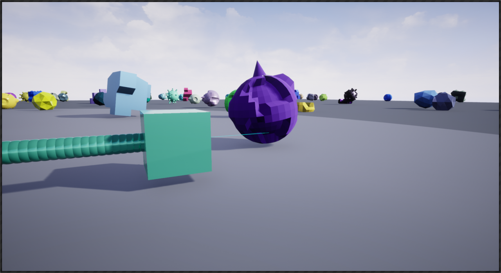

# Ue4RandomExercise
This is a Ue4 programmers test I found online, the instructions are listed below.  The test took me 6 hours and the fluff took another 6.  By fluff I mean creating the level and generating the pieces as shown in this screen shot.

Most of the parameters for the Robot can be set in the level in the RobotDroneBP Object and RobotDroneBP_Child.  Only RobotDroneBP has screenshot and file write enabled (as they are both running at the same time).  The MBPPawnCamSetter object can set the camera to either Robot or leave the default overview camera so you zoom around and see the Robots in action.

## Instructions (Start)
### Setup

Fork this repository before cloning.
Once forked, feel free to submit to it as much as you'd like.
When completed, send us an email and a link to your fork of the repository.

### Create a robot that randomly navigates an environment.

- The pawn should move forward from its starting location anywhere in the map by 10 units at a time until it 'hits' something (until an object is less than 15 units away from it in its forward direction), then rotate left or right a little (randomly, between 5 and 25 degrees), and try moving forward again, repeating the process indefinitely
- The pawn's starting location should be 10 units above the floor; you don't have to enforce this in code, just drop it in and move it up by 10 units
- Rotating and moving forward can happen discretely and don't need to be animated (i.e. move 10 units or rotate n degrees all at once, with every frame representing a new rotation or position)
- In between moves, wait for one second before proceeding to the next move. Where and how this is implemented (C++, BP node graph) is up to you.
- You can assume that the starting Z location of the pawn will always be its Z location (no downward line checks and floor placement necessary)

### Have the robot take pictures and output information

- After every time the pawn moves forward or rotates, take a screenshot and save it to the saved folder, incrementing the name for each image taken. ie: image_1.png, image_2.png, image_3.png, etc..
- In addition to the screenshot, output a text file with a list of the actor names that are in the viewport when the image is taken
  - Each image should have a corresponding text file. ie: image_1.png and image_1_actors.txt
  - An example folder structure would be the following:
    - Project/Saved/
      - Data/
        - image_1.png
        - image_1_actors.txt
        - image_2.png
        - image_2_actors.txt
        
        
The collision check against objects and rotation of the pawn should happen on the C++ side. The easiest way to set this up would likely be a C++ Blueprint with the C++ functionality handling line traces for obstruction checks and choice of new direction called from the blueprint's node graph during tick. Please use UE4 conventions and frameworks for C++ implementation.
**Online research, UE4 documentation, Stackoverflow, etc., are all fair game. Google to your heart's content :)**

When hitting Play In Editor, the viewport should be from the pov of the robot, and it should begin navigating the environment and doing the following:
- Move or turn
- Take an image 
- Write a text file of all actors visible in the viewport
- Wait one second (This can happen asynchronously during the image taking and text file writing)
- Move/turn again and repeat loop

### Create a second robot ###

- This robot should be implemented in blueprints as a child of the previous robot.
- This robot should behave the same way as robot 1, but it should also drop a sphere actor into the level where it is every time it takes an image.
## Instructions (End)

Here is a screenshot of the Robot Child in action

